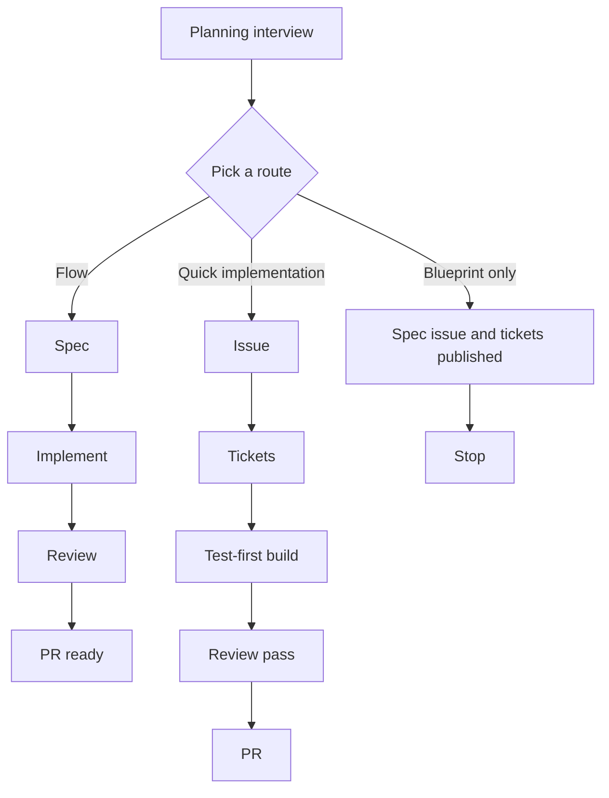

# orchestrator

A Claude Code plugin that takes a change from plan to pull request: a planning
interview, a spec on a GitHub issue, tickets built test-first, and a bounded
review loop - each step in a fresh session, connected only by written handoffs.

## Why separate sessions

One long session that plans, specs, builds, and reviews carries every earlier
phase's context into the next. The reviewer already believes the
implementer's reasoning. Splitting the phases and passing only a written
handoff between them means each phase judges the work, not the story behind
it. Fresh context per phase also leaves room for the human-in-the-loop
exchanges that `orch-to-spec` (test seams) and the spec review depend on.

## Requirements

- Claude Code, or the Junie CLI (see [Install](#install)).
- `gh`, `jq`, and `git`, with `gh` signed in to the repo's GitHub.
- No per-repo setup: issues are labelled with the five canonical triage label
  names (`needs-triage`, `needs-info`, `ready-for-agent`, `ready-for-human`,
  `wontfix`), or with the names a `docs/agents/triage-labels.md` table maps
  them to, when the repo has one. `/orchestrator:health` reports all of this
  at any time, including any of those labels the repo is missing.

## Install

```
/plugin marketplace add maj0rpain/orchestrator
/plugin install orchestrator@orchestrator
```

The repo doubles as its own single-plugin marketplace, so there is no separate
marketplace repo. It installs at user scope, so it is available in every
project on that machine.

On the Junie CLI, see [docs/junie/README.md](docs/junie/README.md).

## Quick start

1. In your repo, run `/orchestrator:interview` and plan the change with it
   until you share an understanding.
2. It closes with one question: pick a flow, a quick implementation, or a
   blueprint only.
3. For a flow, run `/orchestrator:next` in a fresh session (`/clear`) for each
   phase - spec, implement, review - until the PR is ready. A quick
   implementation runs to its PR on its own; a blueprint stops once its spec
   and tickets are published.

## Three routes

Every route starts from a planning session and is chosen by a human, never by
the model. The terms are defined in [GLOSSARY.md](GLOSSARY.md).

**Flow.** The full pipeline: four phases - plan, spec, implement, review -
each in a fresh session, handing off through files. The spec phase publishes
the spec issue and reviews it with you; the implement phase builds the ticket
breakdown test-first, one fresh subagent per ticket, and opens a draft PR; the
review phase runs a bounded review loop that ends with the PR ready, or on a
bounded stop that says why.

**Quick implementation.** The route with no phases: a linked issue -
possibly rewritten from the plan, unattended - an unattended spec review, its ticket breakdown, the same test-first build, a
review pass by the plugin's own reviewer agents, and a PR - in one session.

**Blueprint.** The closing question's "Blueprint only" option: the spec issue
and its ticket breakdown are published, the spec review offered, and then it
stops. A flow or a quick implementation can pick it up later.



Each flow phase runs in its own fresh session. The step-by-step detail is in
[docs/how-it-works.md](docs/how-it-works.md).

## Commands

| Command | What it does |
| --- | --- |
| `/orchestrator:interview` | Start a planning session that ends on the route question. |
| `/orchestrator:start [slug] [--issue N] [--side]` | Start a flow from an approved plan. |
| `/orchestrator:next` | Run the flow's next phase, in a fresh session. |
| `/orchestrator:flow-status` | Phase, issue, branch, PR, and the flow's health. |
| `/orchestrator:health` | Diagnose the machine, the repo, and the active flow. |
| `/orchestrator:redo` | Step back one phase and re-run it. |
| `/orchestrator:abort` | Archive the flow to `.orchestrator/archive/`. |
| `/orchestrator:finish` | Clean up finished side checkouts and flows. |
| `/orchestrator:quick-implement [<issue>] [--side]` | Start a quick implementation. |
| `/orchestrator:to-spec [<issue>]` | Turn the conversation into a spec issue, outside a flow. |
| `/orchestrator:to-tickets <issue>` | Break an issue into tickets, outside a flow. |
| `/orchestrator:spec-review <issue> [--rounds <n>]` | Review a spec issue on demand. |
| `/orchestrator:review-pass <issue> [--smells]` | Run a review pass of the current branch on demand. |
| `/orchestrator:sync` | Merge the base branch into the current plugin-made branch. |
| `/orchestrator:release` | Open the release PR from the base branch into the default branch. |
| `/orchestrator:finding-triage [--all] [<issue> \| --pr <n>] \| --bundle` | Triage the review loop's filed findings, or bundle them. |

Every command in full: [docs/how-it-works.md](docs/how-it-works.md#commands-in-detail).

## Further reading

- [docs/how-it-works.md](docs/how-it-works.md) - the phases, every command in
  full, the base branch, hosts, and the hooks.
- [GLOSSARY.md](GLOSSARY.md) and [docs/adr/](docs/adr/) - the domain language
  and the decisions behind it.
- [docs/host-capabilities.md](docs/host-capabilities.md) - how each host
  provides each capability, and the fallbacks.
- [docs/junie/README.md](docs/junie/README.md) - running on the Junie CLI.
- [CONTRIBUTING.md](CONTRIBUTING.md) - layout, authoring rules, development,
  and reporting a bug.
- [CHANGELOG.md](CHANGELOG.md) - every release.

## License

MIT - see [LICENSE](LICENSE).
