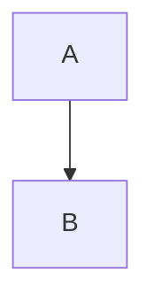

@@ finding 1
Kind: latent bug
Location: a.sh:1, b.sh:2-3
Evidence: it <breaks> when `x & y` runs

```mermaid
graph TD; A-->B
```
Confidence: certain
@@ finding 2
Kind: inefficiency
Location: b.sh:2-3, c.sh:9
Evidence: slow
